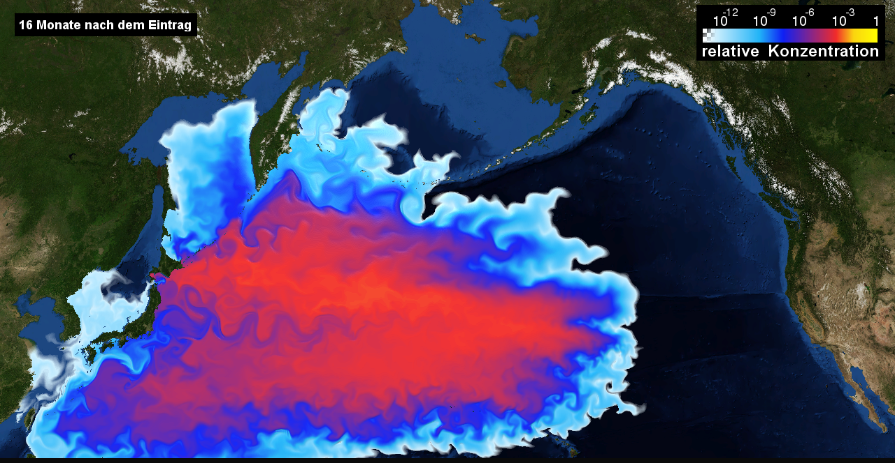
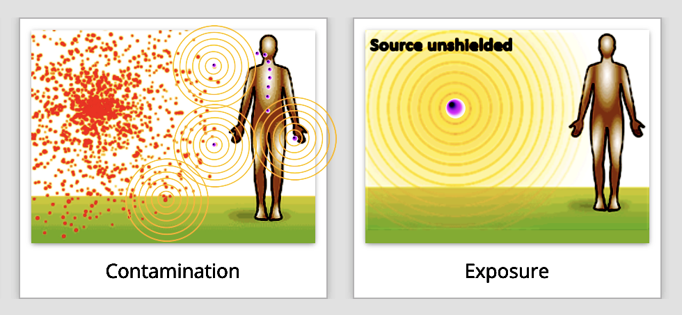
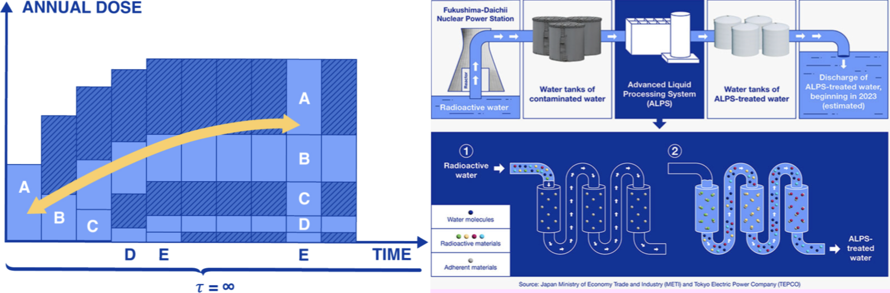
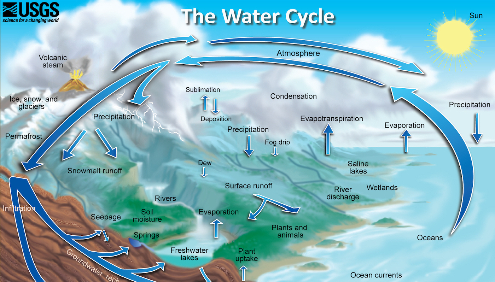

##### UPDATE June 11 2022 : DISCLAIMER: This essay does not debate the efficacy of Nuclear Energy. Official Public comment period to TEPCO closes June 17 2022

# Alert
#### This is a health and safety alert regarding the proposed discharge of treated radioactive water into the Pacific Ocean. Contamination has already been detected in everything from [Fish](https://news.stanford.edu/news/2012/may/tuna-radioactive-materials-053012.html) to [Fine Wine](https://edition.cnn.com/2018/07/23/health/california-wine-radioactive-fukushima-trnd/index.html). Computer models project widespread contamination 57 days after start of discharge process, reaching the US in 5-6 months thereafter. 

SOURCE: [https://www.geomar.de/en/news/article/fukushima-the-fate-of-contaminated-waters](https://www.geomar.de/en/news/article/fukushima-the-fate-of-contaminated-waters)

## Background 
Fukushima Daiichi is the largest nuclear meltdown in history. Currently there are 1.3 million tons of radioactive water stored in tanks near the site of the meltdown. Business implications, including storage costs and real estate negotiations, have resulted in a new plan to discharge the tanks into the Ocean.
 
SOURCE: [https://en.wikipedia.org/wiki/Comparison_of_the_Chernobyl_and_Fukushima_nuclear_accidents](https://en.wikipedia.org/wiki/Comparison_of_the_Chernobyl_and_Fukushima_nuclear_accidents)

## Dispersal of radionuclides
Radioactive contamination of the environment by dispersal of radionuclides is much more hazardous and insidious than exposure to a localized radiation source. If the radionuclides enter the water supply and food supply they will continue to emit radiation for hundreds of years.
 
SOURCE: [https://remm.hhs.gov/index.html](https://remm.hhs.gov/index.html)

## Ocean Discharge
Official plans released by TEPCO explicitly schedule dumping treated radioactive water into the Pacific Ocean. This process will take 30 years of constant discharge into the Ocean. The reports also include expected radiation dose projections for the population. Environmental groups pointed out in 2021 that TEPCO's water treatment technology (ALPS) could not remove tritium or many other radioactive isotopes.
 
SOURCE: [docs/assets/reports/report_1_review_mission_to_tepco_and_meti.pdf](docs/assets/reports/report_1_review_mission_to_tepco_and_meti.pdf)

## International Law
International law prohibits disposal of radioactive waste into the Ocean. The international community must uphold our responsibility to safe nuclear energy and international law. Dumping radioactive waste into the ocean sets a dangerous precedent of acceptable behavior for all nations. 
SOURCE: [docs/assets/reports/london_convention_pdf.pdf](docs/assets/reports/london_convention_pdf.pdf)

## Essence of life
Marine plants produce over 70% of our oxygen. Aquatic invertebrates constitute approximately 90% of life on the planet and play a vital role in ecosystem function. The ocean is critically important in our strategy to solve Climate Change. Irreversibly contaminating the entire Ocean with radioactive materials undermines ecological stability.
 

 
## Generational Effects
Scientists studying marine wildlife around the reactor site are concerned about the effects of radioactive waste on the aquatic environment. Despite claims that these radionuclides will be diluted and therefore, present in only small quantities, these do not account for the accumulation of radionuclides in consumers higher up in the food chain, including humans. Lab studies have also presented evidence for DNA damage to marine wildlife from extended exposure to radioactive particles, especially those which include the same isotopes as ones found at the Fukushima reactor site. These affected wildlife, some of which are mobile, will then have cascading effects on the environment if mutations are passed on through generations of breeding.

## Source Material
Please read Fairewinds Recommendation linked below
All the hard and valuable work in this document was completed and made possible by GEOMAR, Greenpeace, Stanford University, SFGate, Fairewinds Energy Education, New York Times. All linked in original form.

# Resources: 
"Tuna caught off California carry radiation from the Japanese disaster, Stanford scientist finds" 
https://news.stanford.edu/news/2012/may/tuna-radioactive-materials-053012.html

"Scientists say impact of long term low-dose [radiation] exposure to the environment and humans are unknown, and that tritium can have a bigger impact on humans when consumed in fish than in water."
https://www.sfgate.com/news/article/Japan-OKs-plan-to-release-Fukushima-nuclear-plant-17180803.php

"Fukushima Radiation Detected Off California Coast"
https://www.iflscience.com/harmless-levels-fukushima-radiation-detected-california-coast-26283

"Tests of milk samples taken last week in Spokane, Washington., indicate the presence of radioactive iodine from the troubled Fukushima Daiichi nuclear plant in Japan " 
https://www.nytimes.com/2011/03/31/us/31milk.html

### Greenpeace Summary
[https://www.greenpeace.org/static/planet4-japan-stateless/2021/12/9a52607f-public-comment-on-fukushima-radiological-assessment-.pdf](https://www.greenpeace.org/static/planet4-japan-stateless/2021/12/9a52607f-public-comment-on-fukushima-radiological-assessment-.pdf)

### Fairewinds Recommendations:
[https://www.fairewinds.org/fairewinds-recomendation-for-fukushima/?rq=Fairewinds%20reco](https://www.fairewinds.org/fairewinds-recomendation-for-fukushima/?rq=Fairewinds%20reco)

### University of Hawaii Recommendations:
[https://www.hawaii.edu/news/2022/05/02/treated-nuclear-wastewater-dump](https://www.hawaii.edu/news/2022/05/02/treated-nuclear-wastewater-dump)

### Official TEPCO AFPS Water Treatment Plan:
[https://www.iaea.org/sites/default/files/report_1_review_mission_to_tepco_and_meti.pdf](https://www.iaea.org/sites/default/files/report_1_review_mission_to_tepco_and_meti.pdf)

### Official TEPCO Decomissioning site:
[https://www.tepco.co.jp/en/hd/responsibility/index-e.html](https://www.tepco.co.jp/en/hd/responsibility/index-e.html)

### Impact of Radioactive Wastewater on Marine Life
[https://theconversation.com/nuclear-power-how-might-radioactive-waste-water-affect-the-environment-159483](https://theconversation.com/nuclear-power-how-might-radioactive-waste-water-affect-the-environment-159483)

### Fukushima: Contaminated water could damage human DNA
[https://www.bbc.com/news/world-asia-54658379](https://www.bbc.com/news/world-asia-54658379)

### Overview by Greenpeace 
[https://www.greenpeace.org/static/planet4-japan-stateless/2021/03/ff71ab0b-finalfukushima2011-2020_web.pdf](https://www.greenpeace.org/static/planet4-japan-stateless/2021/03/ff71ab0b-finalfukushima2011-2020_web.pdf)

### 3D Animated Reactor Overview
[https://www.youtube.com/watch?v=YBNFvZ6Vr2U](https://www.youtube.com/watch?v=YBNFvZ6Vr2U)

