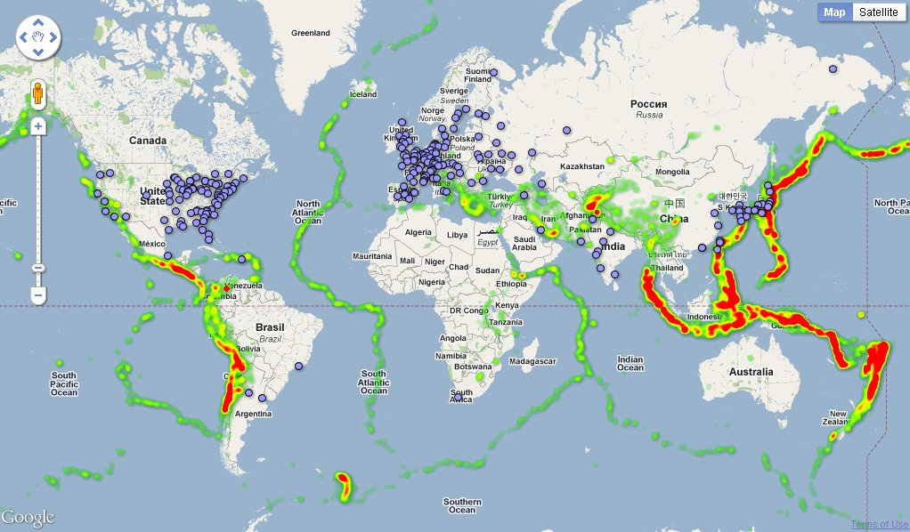

##### UPDATE 2022.06.03 : DISCLAIMER: This essay does not debate the efficacy of Nuclear Energy. 
Public comment period open May 18 2022 - June 17 2022

# Alert
#### This is an urgent health and safety alert regarding the proposed discharge of radioactive waste into the Pacific Ocean. Computer models show widespread contamination of nearly half the Pacific Ocean in 57 days after start of discharge process. Radioactive contamination projected to reach the west coast of the United States in 5-6 months. 

####### SOURCE: https://www.geomar.de/en/news/article/fukushima-the-fate-of-contaminated-waters

Radioactive contamination of the environment by dispersal of radionuclides is much more hazardous than exposure to a localized radiation source. If the radionuclides enter the water supply, food supply they will continue to emit radiation for hundreds of years, in some cases millions of years. 
 
####### SOURCE: https://remm.hhs.gov/index.html

Independent review by scientists and independent organizations like Greenpeace assert the radiological hazards of the Fukushima Daiichi Ocean Discharge proposal are globally unprecedented. Official reports released by TEPCO reveal that radioactive material will be present in the water being discharge into the Pacific Ocean. The reports also include expected population level radiation dose increase. 
 
###### SOURCE: https://www.iaea.org/sites/default/files/report_1_review_mission_to_tepco_and_meti.pdf

# International Precedent
Radioactive waste dumping into the Ocean was banned under international law in 1972. Marine plants produce over 70% of our oxygen and the ocean is vitally important in our strategy to solve Climate Change. During the initial leaks "Monitoring data showed the concentration of Cesium in the waters near Fukushima was 100,000 becquerels per cubic meter, which is 100 times higher than what was detected in the Black Sea after the Chernobyl disaster. "
 

# Treatment Audit
International environmental groups pointed out in 2021 that TEPCO's water treatment technology of polynuclide removal facility could neither remove tritium or carbon-14, nor completely remove other radioactive isotopes such as strontium- 90, iodine-129 and cobalt-16.
##### SOURCE: http://www.stdaily.com/English/BusinessNews/202206/168a45f9ca3844fcb1f3060d50689f3a.shtml

##### SOURCE: https://www.greenpeace.org/static/planet4-japan-stateless/2021/12/9a52607f-public-comment-on-fukushima-radiological-assessment-.pdf

## International Precedent
If the international community accepts one country dumping radioactive waste into the ocean, it sets the precedent of acceptable behavior and Ocean Dumping may be considered as acceptable for other nations as well. It has been well understood since 1972 that the consequences of disposing radioactive material in the ocean are impossible to anticipate. 

# International Opportunity
Currently there are 1.3 million tons of radioactive water stored in tanks near the site of the original disaster. This process took 11 years and $178 Billion USD. 

### Summary 

## Back background
Our oceans are a natural resource of incalculable value. 

## Resources: 
#### Greenpeace Summary
https://www.greenpeace.org/static/planet4-japan-stateless/2021/12/9a52607f-public-comment-on-fukushima-radiological-assessment-.pdf

#### University of Hawaii Statement:
https://www.hawaii.edu/news/2022/05/02/treated-nuclear-wastewater-dump/

#### Official TEPCO AFLS Water Treatment Plan:
https://www.iaea.org/sites/default/files/report_1_review_mission_to_tepco_and_meti.pdf

#### Official TEPCO Decomissioning site:
https://www.tepco.co.jp/en/hd/responsibility/index-e.html

Modern nuclear powerplants have enhanced safety features and default safe designs which enable them operate to in the event of a power outage. At the same time new developments 

## Proposed Solution
Honor the work of the engineering teams for the last 12  , the engineers for the last 12 years.  Fukushima Will become the global beacon for 
img of animale types across tanks , and industry inputs across tanks, iteratively

## Summary of Risks

## Combinatorial Effects
Modern industry has resulted in thousands of synthetic chemicals flooding our natural environment.  Need extensive testing. Pefect opportunity with large isolated equally divided tanks. 

## Water Desalination Future
Consideration of water usage scenarios where desalination may provide drinking water may become unfeasable if long lived radioniclide concentrations exceed safe thresholds. 

## Surf Aerosol 
Coastal communities often experience surf aerosols. 

### Top Proposals 
-- concrete lake
-- evaporation
