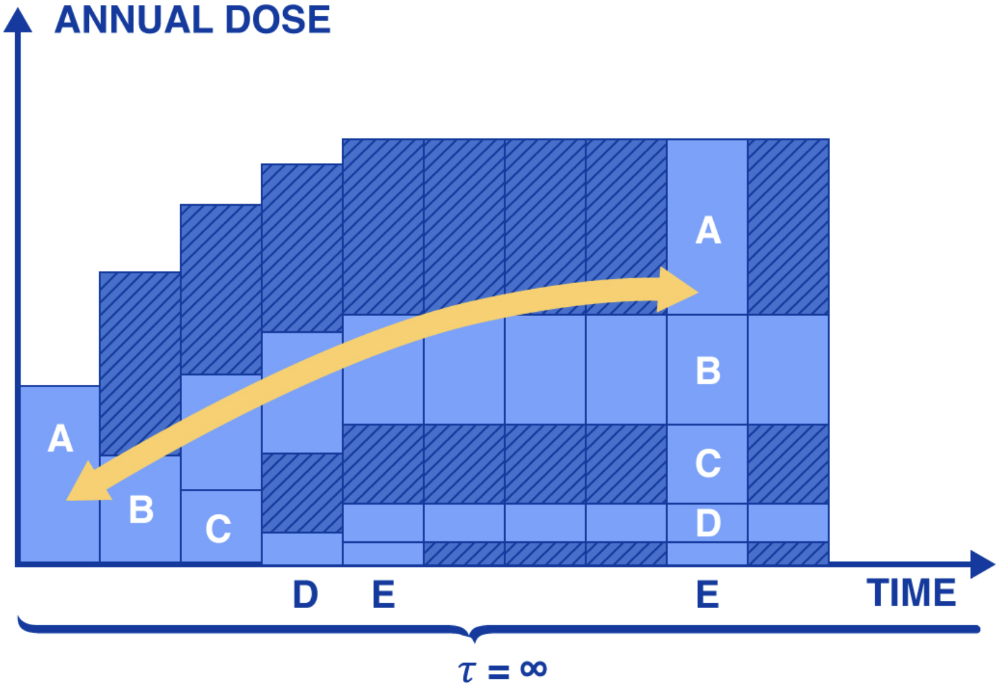

##### Final Semester. UPDATE 2022.06.03
Public comment period open the final decision to dump radioactive wastewater from Fukushima into the Pacific Ocean. 
##### DISCLAIMER: This essay does not debate the efficacy of Nuclear Energy. 

# Alert
#### This is an urgent health and safety alert regarding the proposed discharge of radioactive waste into the Pacific Ocean. Computer models show widespread contamination of nearly half the Pacific Ocean in 57 days, with radioactive contamination reaching the west coast of the United States in 5-6 months. 

Radioactive contamination of the environment through dispersal of radionuclides is irreversible. Accumulated or ingested radionuclides will continue to emit radiation for hundreds of years, in some cases millions of years. Independent review by scientists and independent organizations like Greenpeace assert the radiological hazards of the Fukushima Daiichi Ocean Discharge proposal are globally unprecedented.
 

Even official reports released by TEPCO reveal that radioactive material will not be completely removed before discharge into the Pacific Ocean. The reports also include expected population level radiation dose increase. 
 

Numerous claims advertised in the official reports have been challenged by scientists.

Radioactive waste dumping in the Ocean was banned under international law in 1972. Marine plants produce over 70% of our oxygen and the ocean is vitally important in our strategy to solve Climate Change. During the initial leaks "Monitoring data showed the concentration of Cesium in the waters near Fukushima was 100,000 becquerels per cubic meter, which is 100 times higher than what was detected in the Black Sea after the Chernobyl disaster. "

# Background
Currently there are 1.3 million tons of radioactive water stored in tanks near the site of the original disaster. This process took 11 years and $178 B USD 

### Summary 

## Back background
Our oceans are a natural resource of incalculable value. 

Resources: 
Greenpeace Summary
https://www.greenpeace.org/static/planet4-japan-stateless/2021/12/9a52607f-public-comment-on-fukushima-radiological-assessment-.pdf

Modern nuclear powerplants have enhanced safety features and default safe designs which enable them operate to in the event of a power outage. At the same time new developments 

# Proposed Solution. 
Honor the work of the engineering teams for the last 12  , the engineers for the last 12 years.  Fukushima Will become the global beacon for 
img of animale types across tanks , and industry inputs across tanks, iteratively

### Summary of Risks

### Combinatorial Effects
Modern industry has resulted in thousands of synthetic chemicals flooding our natural environment.  Need extensive testing. Pefect opportunity with large isolated equally divided tanks. 

# Water Desalination Future

# Surf Aerosol 
Coastal communities often experience surf aerosols. 

### Top Proposals 
-- concrete lake
-- evaporation
