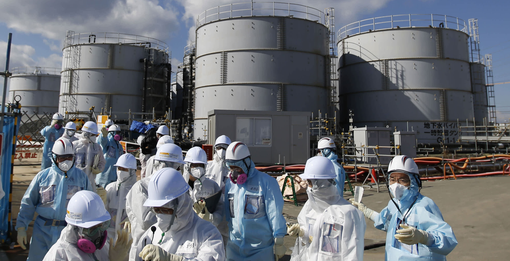
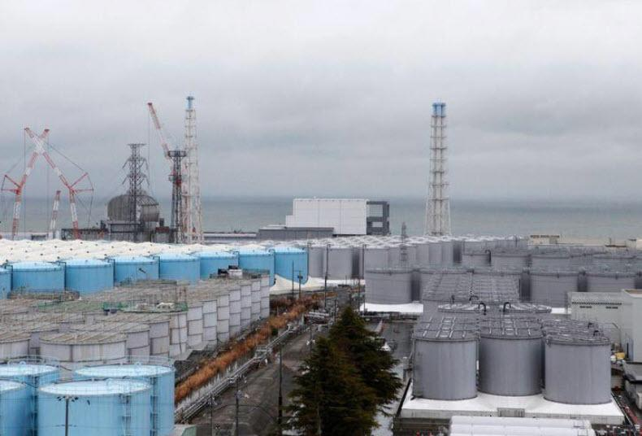

 
###### Environmental Impact Report ESA201
##### DISCLAIMER: This essay does not question or debate the efficacy of Nuclear Energy. It is only an analysis of the health and safety data and potential implications of a controlled planetary radionuclide release. Our ocean is a resource of incalculable value. Marine plants produce over 70% of our oxygen. The ocean is centrally important in our struggle against Climate Change. 
##### Final Semester. 2022.07.01

# Summary
Japan has opened a public comment period regarding the final decision on storing or dumping radioactive wastewater from the Fukushima disaster into the Pacific Ocean. In 1972, dumping radioactive waste into the ocean was banned and internationally prohibited by the London Convention.

# Background
Currently there is 1.3 million tons of radioactive water stored in tanks near the site of the original disaster. The process took 11 years and $178 B USD 

### Summary 

## Back background
Our oceans are a natural resource of incalculable value. 

Modern nuclear powerplants have enhanced safety features and default safe designs which enable them operate to in the event of a power outage. At the same time new developments 

# Proposed Solution. 
Honor the work of the engineering teams for the last 12  , the engineers for the last 12 years.  Fukushima Will become the global beacon for 
img of animale types across tanks , and industry inputs across tanks, iteratively

### Summary of Risks

### Combinatorial Effects
Modern industry has resulted in thousands of synthetic chemicals flooding our natural environment.  Need extensive testing. Pefect opportunity with large isolated equally divided tanks. 

# Water Desalination Future

# Surf Aerosol 
Coastal communities often experience surf aerosols. 

### Top Proposals 
-- concrete lake
-- evaporation
